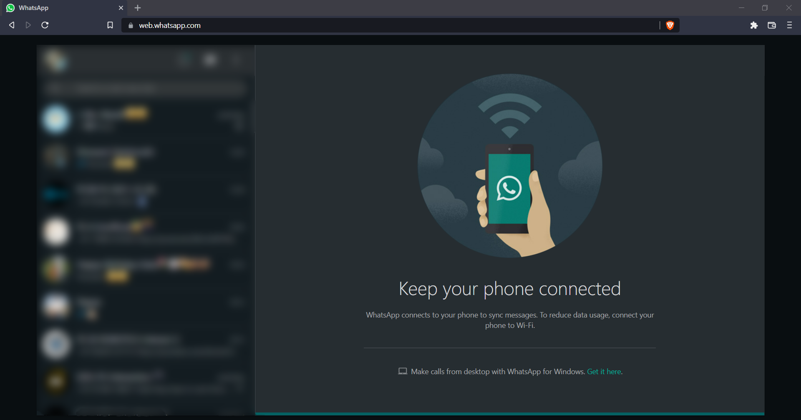
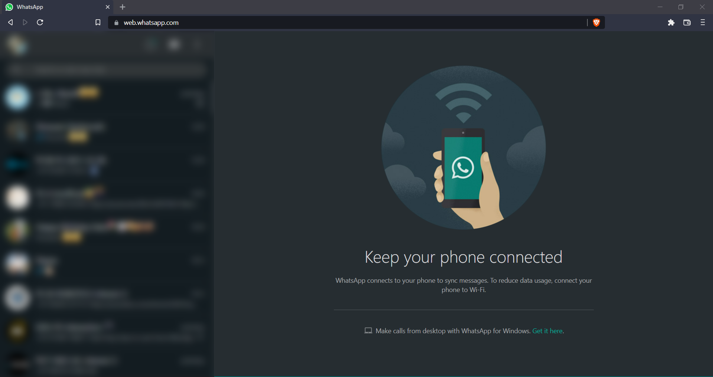

# WhatsApp Web - Full Screen Chats

Chrome extension to to remove the margin around the chat screen while using WhatsApp Web

It looks for the chat screen on WhatsApp Web and modifies it's dimensions to disable the margin around it.  
Moreover there are no memory footprints as everything is done using CSS

This can work on Chrome/Brave/Edge or any other chromium based web browser

## Before:

## After

---

## Installation Instructions:
- Clone this repo / Download and extract in a folder
- Goto [Extentions Page](chrome://extension) and enable developer mode
- Click **Load Unpacked** and select **Extension** folder from repo
- Refresh WhatsApp Web for if you already have it open for changes to take effect
